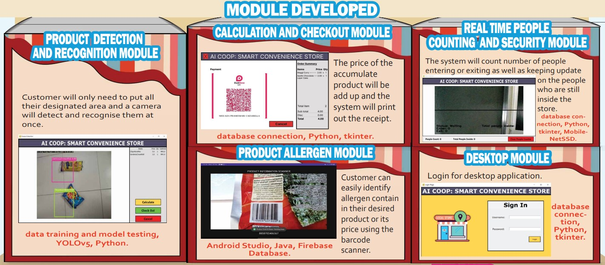
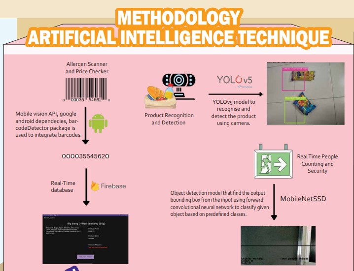
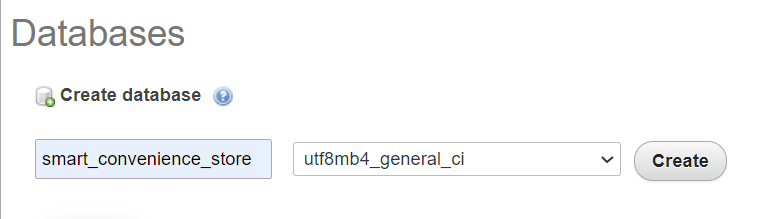
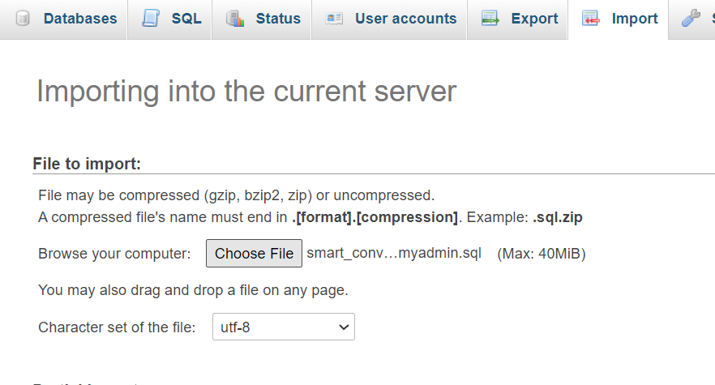
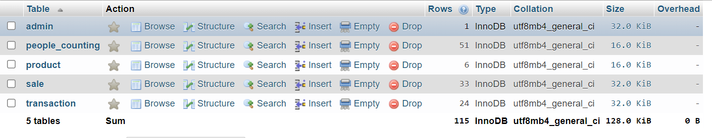
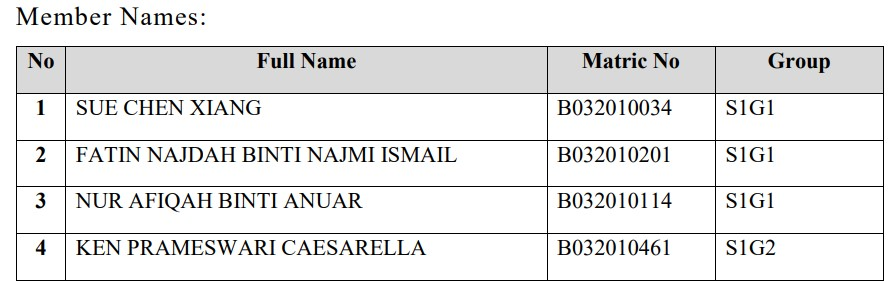

# Smart Convenience Store
A smart convenience store system is a retail system that combines traditional convenience store operations with advanced technology such as Machine Learning and computer vision to create a more efficient, secure, and personalized shopping experience for customers. Machine learning algorithms can be used to predict consumer demand, optimize product placement, and provide personalized product recommendations. Computer vision can be used for tasks such as people counting, object detection, and item recognition, which can be used for security and marketing purposes. The system can also include features such as self-checkout and mobile payments, making the shopping experience more convenient for customers. In addition, the system can also provide valuable insights to store managers, helping them make data-driven decisions, such as which products to stock, and when to restock them. Overall, a smart convenience store system aims to improve the efficiency and convenience of retail operations, while providing customers with a personalized and secure shopping experience, using advanced technologies.

# System Architecture 
The system is built with implementation of a convolutional neural network (CNN) transfer learning technique to train a model to recognise the type of product from the input image from the camera using PyTorch library and YOLOv5 model. The system also uses another deep neural network (DNN) model which can count the number of people going inside or going outside of the convenience store using MobileNet Single Shot Detector (SSD) model. Both the pre-trained object detection network model is loaded using OpenCV’s dnn module. This will enable us to pass input images through the network and obtain the output bounding box (x,y) coordinates of each recognized object in the image.

# Full Poster

[Click for full poster](assets/poster.pdf)

# Full Report

[Click for full report](assets/report.pdf)

# Module Developed



# Artificial Intelligence Technique



# Accuracy of Artificial Intelligence Technique


## Installation

1. You need to have python version 3.10.4 installed in ur computer. If not, can download from  https://www.python.org/downloads/release/python-3104/

2. Clone this github repository

```
git clone https://github.com/chxiang93/workshop2-smart-convenience-store.git
```

3. cd to the project directory

```
cd workshop2-smart-convenience-store
```

4. Install all the requirements library

```
pip install -r requirements.txt
```

5. Before running the system, we need to set up the database first. In phpMyAdmin, create a database call smart_convenience_store



Then, in the smart_convenience_store database, import the smart_convenience_store_phpmyadmin.sql that can be found inside smart-convenience-store code folder.



Figure below shows the database after importing the sql file



6. Run the main program

```
python LoginPage.py
```

7. Install the product healthiness module program. Install the barcode_scanner.apk that locate inside the ProductHealthinessModule folder in an android device.

# Group Members


